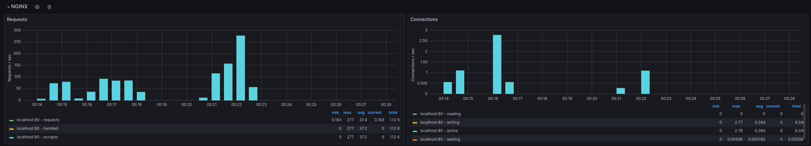
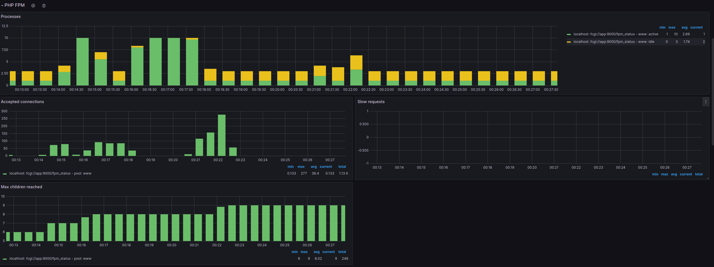
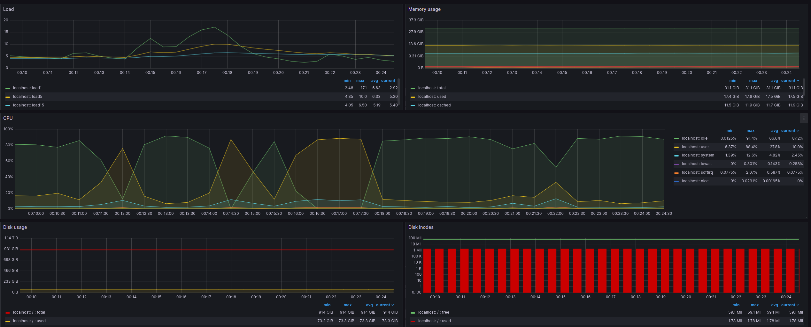
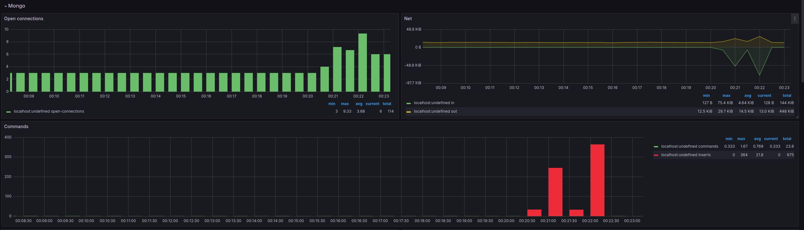
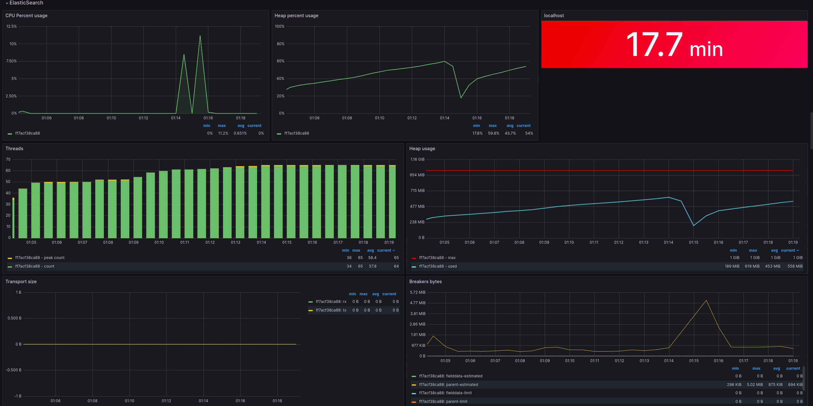

# TIG Stack with PHP project

Application containers:
- php-fpm (app)
- nginx
- mongo (MongoDB)
- elasticsearch

Monitoring containers:
- telegraf
- influxdbW
- grafana

## Start
Run command `./start.sh` to start the project

## Siege Testing
1. Install `siege` on your machine
2. Run command `./run-siege.sh` to run stress test

## Loading System
1. Install `siege` tool for loading
2. Run `siege -r"{repeat count}" -c"{concurrency}" {http://yourexamplapiendpoint.com}` with needed api endpoints to start loading system

## Monitoring Dashboard
1. To open grafana, follow this link `http://localhost:3000/`
2. Standard `username:password` are `admin:admin`
3. You can find some samples pictures in `screenshots` folder

### Example of loading

#### Nginx 

#### PHP-FPM

#### System

#### MongoDB

#### ElasticSearch

